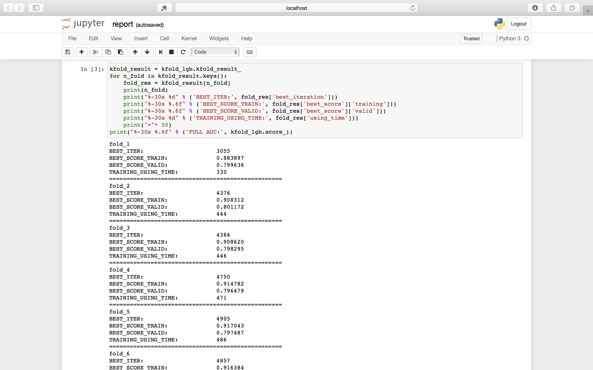
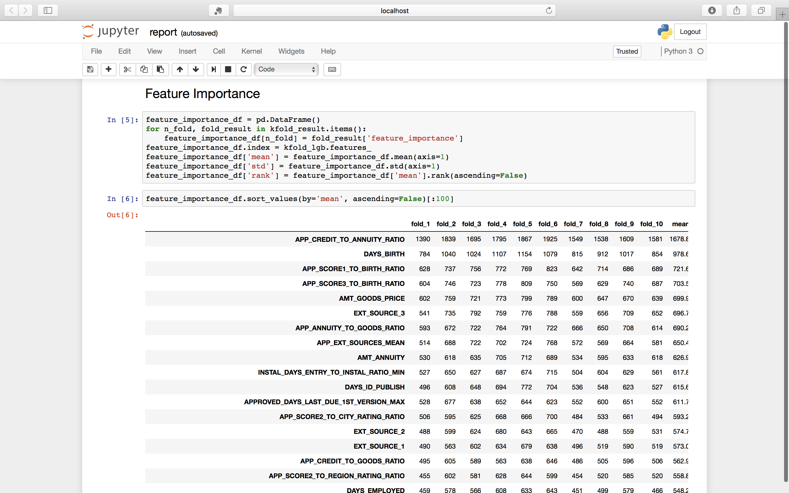
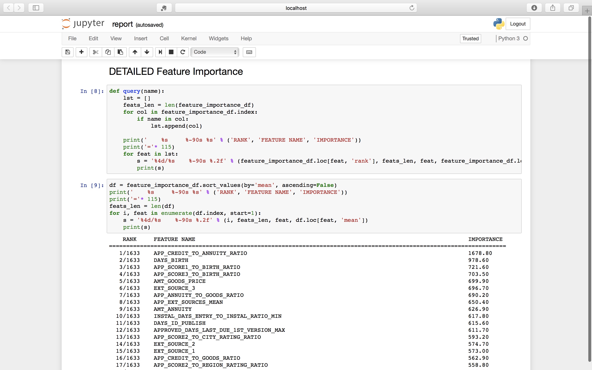

## Solution for Kaggle Competition - [Home Credit Default Risk](https://www.kaggle.com/c/home-credit-default-risk)
<p>Here is my personal solution for the Kaggle Competition - Home Credit Default Risk. </p>
<p>Final Standing is **113/7198**.</p>
<p>EDA and other analysis can be found in the dir notebook.</p>

### Quick Start
Firstly, remember to check the IO and param setting for the model in the dir `config`. And make the workdir and input dir for dataset.

Then `cd` to the root path and run the model.

There are 6 modes in this work to satisfy the basic need in the competition which are respectively:

1. <font color="CornflowerBlue" face="黑体">**ALL**</font> - the default chioce, extract features, train a [LightGBM](https://lightgbm.readthedocs.io/en/latest/) Boosting model and make prediction based on the test data.
2. <font color="CornflowerBlue" face="黑体">**TRAIN**</font> - only train the model, so you must specify the path of train data.
3. <font color="CornflowerBlue" face="黑体">**PREDICT**</font> - only do the prediction based on the test data, so the name of a pretrained task is necessary.
4. <font color="CornflowerBlue" face="黑体">**EXTRACT**</font> - only extract features and save the dataset to the workdir.
5. <font color="CornflowerBlue" face="黑体">**SEARCH**</font> - perform the grid param search, the setting file can be found in the dir `config`.
6. <font color="CornflowerBlue" face="黑体">**STACKING**</font> - perform the stacking, the setting file can be found in the dir `config`.

USAGE:
```
	# run the prog in "all"(default) mode and name the task as "MyFirstBaseline"
	python main.py -n MyFirstBaseline

	# do stacking
	python main.py -m stacking -n MyFirstStacking

	# grid search params and use the train and test data in the specified path
	python main.py -m search --train-data /your/path/to/train_df --test-data /your/path/to/test_df -n SearchParams

	# extract features
	python main.py -m extract -n OnlyExtractFeatures

	# only train a model
	python main.py -m train --train-data /your/path/to/train_df -n OnlyTraining

	# make predictions using the model you've choosed "ThePreTrainedModel"
	python main.py -m predict --test-data /your/path/to/test_df -n ThePreTrainedModel
```
### Check the result after each running
After training, just go the filefolder where your model is saved and check the report about the performance.





### My Competition Strategy
1. Alway take EDA seriously, get fully understand each column in the table and try to find some potential connections between the variable and the target.
2. Find a decent Kernel in the competition and Build a basline quickly based on it.
3. Speed up iteration on your model and Squeeze more ideas about Features as hard as you can.
4. Tuning the params when the feature engineering is basically fished.
5. Try Stacking when having no more ideas about how to improve the performance.

<font size="4">Finally, [Click Here](https://www.kaggle.com/sediment) to follow me if you like 😇</font>

## Reference:
[[Updated 0.792 LB] LightGBM with Simple Features
](https://www.kaggle.com/jsaguiar/updated-0-792-lb-lightgbm-with-simple-features)

[Start Here: A Gentle Introduction
](https://www.kaggle.com/willkoehrsen/start-here-a-gentle-introduction)


